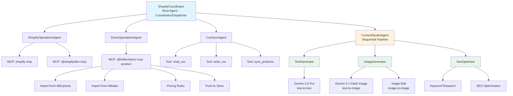

# Shopify Agent with Google ADK

A simple multi-agent workflow to help with my shopify drop-shipping:
- Built with Google ADK Multi-Agent Hierarchy
- 3 MCP toolsets: [Shopify Store MCP](https://github.com/geli2001/shopify-mcp), [Shopify Dev MCP](https://shopify.dev/docs/apps/build/devmcp), [DSers MCP](https://github.com/lofder/dsers-mcp-product)
- Custom agents to use the MCP toolsets and other defined tools

I used this to:
0. Learn about agent development with ADK.
1. Conversationally interact with my shop & its products.
2. Import products from AliExpress/Alibaba via DSers.
3. Updated product content w/ Ai generated content.

Whats next:
1. Provide more context of the store - may helps when generating content for products.
2. Prompt improvement - may help improve understanding of MCPs for the Agents so better workflows.

## Background

Using **Google ADK Multi-Agent Hierarchy** with the **Coordinator/Dispatcher Pattern** + **Sequential Pipeline** for content workflows.



```
ShopifyCoordinator (Root Agent)
├── ShopifyOperationsAgent (Shopify MCP tools)
├── DsersOperationsAgent (DSers import & push)
├── CsvSyncAgent (CSV read/write, product mapping)
└── ContentStudioAgent (AI content generation)
    ├── TextGenerator (title/description generation - text-to-text)
    ├── ImageGenerator (product images - text-to-image, image-to-image)
    └── SeoOptimizer (SEO optimization & keyword enhancement)
```

## Workflows

### DSers Quick Import
Import from AliExpress/Alibaba and push directly to your store:
```
User: "Import this product from AliExpress and push to my store: [URL]"
→ dsers_operations imports → dsers_operations pushes (with pricing rules if specified)
```

### DSers + AI Content
Import via DSers, then generate AI content before pushing:
```
User: "Import from AliExpress, generate AI content, then push"
→ dsers_operations imports → content_studio generates → dsers_operations updates → dsers_operations pushes
```

### CSV-Based Product Onboarding
For suppliers providing CSV files:
```
User: "Import products from supplier.csv and generate store-ready content"
→ csv_sync reads → content_studio generates → shopify_operations creates → csv_sync updates mapping
```

## Setup 

### Prerequisites

1. **Shopify**: Get shopify domain (xxx.myshopify.com), shopify client id, and shopify client secret after creating a new app. (Follow directions of https://github.com/geli2001/shopify-mcp to provide the proper scopes 'read_products, write_products, read_customers, write_customers, read_orders, write_orders'
2. Install the app in Shopify.
3. **Google AI**: Get google api key from https://aistudio.google.com
4. **DSers** (optional): Have a DSers account (free plan works) with Shopify store connected

### Install MCP Servers

```bash
# Shopify MCP servers
npx -y @shopify/dev-mcp@latest
npx -y shopify-mcp

# DSers MCP (with OAuth login)
npx -y @lofder/dsers-mcp-product login
npx -y @lofder/dsers-mcp-product
```

### Python Setup

```bash
python -m venv .venv
pip install -r requirements.txt
```

### Run

```bash
adk run main
```